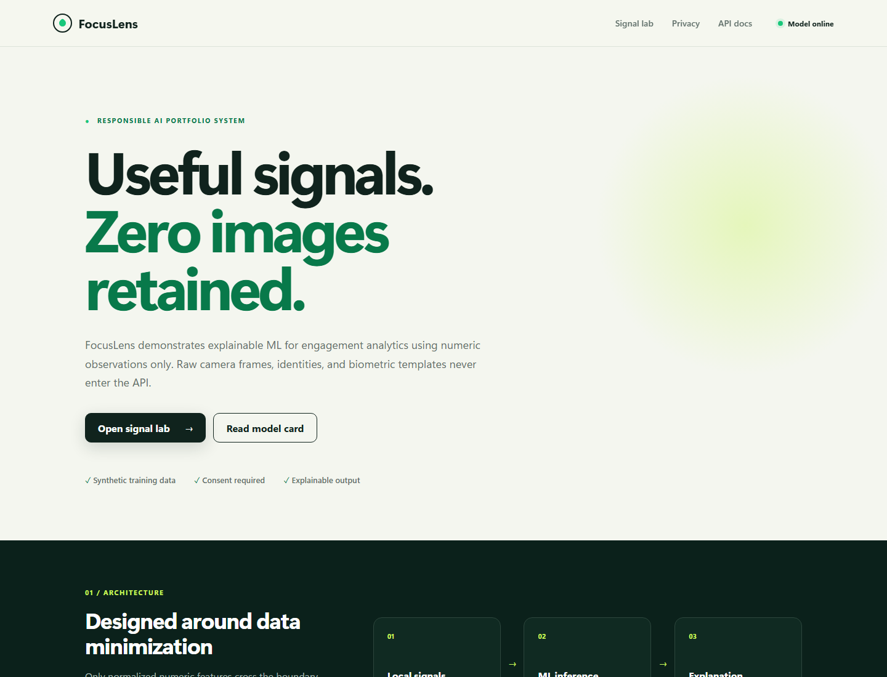
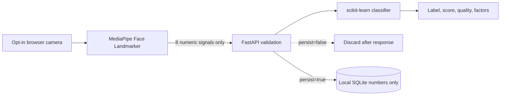

# FocusLens AI

[](https://github.com/MontassarBenMesmia/focuslens-ai/actions/workflows/ci.yml)
[](https://www.python.org/)
[](https://fastapi.tiangolo.com/)
[](https://github.com/MontassarBenMesmia/focuslens-ai/pkgs/container/focuslens-ai)
[](LICENSE)

Privacy-first, end-to-end webcam signal extraction and explainable session analytics.

FocusLens runs a voluntary 10-second webcam measurement for adult self-use. MediaPipe Face Landmarker processes frames inside the browser and reduces them to eight bounded numeric signals. Only that numeric summary reaches the FastAPI service; frames, photographs, audio, identities, and biometric templates are never uploaded or stored.

The result is a transparent **session-stability demonstration** (`stable`, `variable`, or `interrupted`) rather than a claim about attention, productivity, emotion, intent, or health.

> **Responsible-use notice:** This is a synthetic-model engineering demonstration for voluntary adult self-reflection. Never use it to monitor, grade, rank, discipline, diagnose, or make decisions about another person.



## What happens when you use it

1. You confirm informed consent and that you are an adult analyzing only yourself.
2. Your browser requests camera permission only after you click **Start**.
3. MediaPipe measures landmarks locally for 10 seconds.
4. The camera stops automatically.
5. Eight numeric signals are sent to FastAPI.
6. A scikit-learn model returns a stability label, score, confidence, signal quality, and three leading factors.

The manual sliders and deterministic synthetic sample remain available for testing without a webcam.

## Privacy guarantees

- Raw frames never cross the browser boundary.
- The API has no image, video, audio, identity, age, name, or demographic field.
- Unknown fields are rejected with `422 Unprocessable Entity`.
- Camera access is restricted to the same origin by `Permissions-Policy`.
- The browser camera stream is stopped after 10 seconds, on manual stop, and when leaving the page.
- Persistence is off by default and, when selected, stores only numeric observations.
- No personal dataset, child imagery, camera capture, trained binary, or secret is committed.
- Training data is deterministic and synthetic.

## Architecture



MediaPipe's JavaScript/WASM runtime and face-landmarker model are downloaded from pinned public URLs when camera mode is first started. They execute in the browser; the third-party hosts do not receive camera frames from this application. See the [architecture guide](docs/architecture.md) for trust boundaries and deployment details.

## Signals

| Signal | Range | Browser-derived meaning |
| --- | ---: | --- |
| `eye_openness` | 0–1 | Average inverse eye-blink blendshape |
| `gaze_stability` | 0–1 | Stability of iris position during the short window |
| `head_alignment` | 0–1 | Horizontal nose alignment relative to the eyes |
| `blink_rate` | 0–60 | Observed blink transitions extrapolated per minute |
| `mouth_activity` | 0–1 | Average jaw-open blendshape |
| `face_presence` | 0–1 | Share of processed frames containing one face |
| `movement_level` | 0–1 | Normalized frame-to-frame nose movement |
| `framing_stability` | 0–1 | Stability of face position and apparent size |

These measurements are noisy proxies affected by lighting, camera position, eyewear, movement, device performance, and model limitations. They do not reveal a person's internal state.

## Technology stack

| Area | Technologies |
| --- | --- |
| On-device vision | MediaPipe Tasks Vision, browser `getUserMedia` |
| API | Python 3.12, FastAPI, Pydantic |
| ML | scikit-learn, NumPy, Joblib |
| Storage | SQLite with explicit opt-in persistence |
| UI | Semantic HTML, responsive CSS, JavaScript modules |
| Delivery | Docker, Docker Compose, GitHub Actions, Dependabot |
| Quality | Pytest, Node test runner, API/privacy contract tests |

## Quick start

### Docker

```bash
git clone https://github.com/MontassarBenMesmia/focuslens-ai.git
cd focuslens-ai
docker compose up --build
```

Open http://localhost:8000. Browser camera APIs work on `localhost`; a remote deployment must use HTTPS.

Other endpoints:

- Swagger UI: http://localhost:8000/docs
- Model card API: http://localhost:8000/api/v1/model-card
- Health: http://localhost:8000/api/health

### Local Python

```bash
python -m venv .venv
# Windows: .venv\Scripts\activate
# Linux/macOS: source .venv/bin/activate
python -m pip install -e ".[dev]"
uvicorn focuslens.api:app --reload
```

Windows users can also run `./scripts/dev.ps1`.

## API example

```http
POST /api/v1/analyze
Content-Type: application/json
```

```json
{
  "eye_openness": 0.72,
  "gaze_stability": 0.81,
  "head_alignment": 0.76,
  "blink_rate": 16,
  "mouth_activity": 0.18,
  "face_presence": 1,
  "movement_level": 0.24,
  "framing_stability": 0.79,
  "source": "camera",
  "observation_window_seconds": 10,
  "consent_confirmed": true,
  "adult_self_use_confirmed": true,
  "persist": false
}
```

Example response:

```json
{
  "observation_id": null,
  "session_label": "stable",
  "confidence": 0.902,
  "stability_score": 0.9505,
  "signal_quality": 0.903,
  "factors": [
    { "feature": "gaze_stability", "influence": "supports", "magnitude": 0.8976 }
  ],
  "model_version": "1.1.0",
  "processed_at": "2026-09-29T10:00:00Z",
  "privacy": "numeric-signals-only"
}
```

## Reproducible training

The first application start trains the model automatically. To train it explicitly:

```bash
python -m focuslens.train --output artifacts/focus_model.joblib --samples 8000
```

The generated artifact and metrics are ignored by Git. Synthetic source generation and the training pipeline are the auditable system of record.

## Testing

```bash
python -m pip install -e ".[dev]"
python -m pytest
npm test
```

The suites cover deterministic generation, training, explanations, input bounds, consent, adult self-use confirmation, privacy headers, image rejection, opt-in persistence, and browser signal aggregation.

## Repository structure

```text
focuslens-ai/
|-- src/focuslens/          API, model, synthetic data, storage, dashboard
|-- tests/                  Python model and API tests
|-- tests-js/               Browser signal-processing unit tests
|-- docs/                   Architecture, model/data cards, responsible AI
|-- scripts/                Local developer workflow
|-- .github/                CI and dependency automation
|-- Dockerfile
`-- docker-compose.yml
```

## Responsible AI

Read the [responsible-AI policy](docs/responsible-ai.md), [model card](docs/model-card.md), and [synthetic data card](docs/data-card.md) before adapting this project.

## Project history and attribution

FocusLens is a standalone, from-scratch reconstruction inspired by concepts explored in a collaborative academic prototype. No original camera captures, datasets, identity-recognition code, trained binaries, or private media were copied.

The archived attention module explicitly credited **Firas Guesmi**. This repository does not claim authorship of that module or other former team contributions. See [NOTICE.md](NOTICE.md) for the full provenance statement.

Developed and maintained by [Montassar Ben Mesmia](https://github.com/MontassarBenMesmia).

## License

The new FocusLens implementation is released under the [MIT License](LICENSE). The license does not apply to excluded academic archives, datasets, images, or model artifacts.
