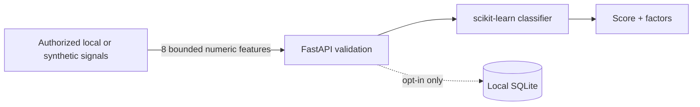

# FocusLens AI

[](https://github.com/MontassarBenMesmia/focuslens-ai/actions/workflows/ci.yml)
[](https://www.python.org/)
[](https://fastapi.tiangolo.com/)
[](LICENSE)

Privacy-first, explainable engagement-signal analytics built as a responsible AI portfolio project.

FocusLens transforms bounded numeric observations into an explainable demonstration score. It does **not** accept images, store video, recognize identities, or infer demographic attributes. Training data is generated deterministically from source code, and persistence is opt-in.

> **Responsible-use notice:** Appearance does not reliably reveal attention, emotion, intent, or health. FocusLens is an engineering demonstration—not a surveillance, grading, employment, medical, or safety system.


## Why this project stands out

- Privacy enforced at the API boundary: unexpected fields such as `image` are rejected
- Consent required for every analysis request
- No personal dataset, child imagery, biometric template, or trained binary in Git
- Reproducible synthetic-data generation and local model training
- Explainable results using signed per-feature contributions
- Persistence disabled by default and limited to numeric observations
- Machine-readable model card plus detailed model, data, and responsible-AI documentation
- Polished interactive dashboard, OpenAPI documentation, Docker, and CI

## Architecture



See the [architecture guide](docs/architecture.md) for boundaries, model lifecycle, persistence, and failure behavior.

## Technology stack

| Area | Technologies |
| --- | --- |
| API | Python 3.12, FastAPI, Pydantic |
| ML | scikit-learn, NumPy, Joblib |
| Storage | SQLite with explicit opt-in persistence |
| UI | Semantic HTML, responsive CSS, vanilla JavaScript |
| Delivery | Docker, Docker Compose, GitHub Actions, Dependabot |
| Quality | Pytest, API contract tests, privacy regression tests |

## Quick start

### Docker

```bash
git clone https://github.com/MontassarBenMesmia/focuslens-ai.git
cd focuslens-ai
docker compose up --build
```

Open:

- Dashboard: http://localhost:8000
- Swagger UI: http://localhost:8000/docs
- Model card API: http://localhost:8000/api/v1/model-card
- Health: http://localhost:8000/api/health

### Local Python

```bash
python -m venv .venv
# Windows: .venv\Scripts\activate
# Linux/macOS: source .venv/bin/activate
python -m pip install -e ".[dev]"
uvicorn focuslens.api:app --reload
```

Windows users can also run:

```powershell
.\scripts\dev.ps1
```

## API example

```http
POST /api/v1/analyze
Content-Type: application/json
```

```json
{
  "eye_openness": 0.72,
  "gaze_stability": 0.81,
  "head_alignment": 0.76,
  "blink_rate": 16,
  "mouth_activity": 0.18,
  "face_presence": 1,
  "hand_activity": 0.24,
  "posture_stability": 0.79,
  "consent_confirmed": true,
  "persist": false
}
```

Example response:

```json
{
  "observation_id": null,
  "attention_label": "focused",
  "confidence": 0.7412,
  "attention_score": 0.8463,
  "energy_signal": "steady",
  "fatigue_signal": 0.1642,
  "factors": [
    { "feature": "gaze_stability", "influence": "supports", "magnitude": 1.083 }
  ],
  "model_version": "1.0.0",
  "processed_at": "2026-09-29T10:00:00Z",
  "privacy": "numeric-signals-only"
}
```

Sending an image, identity, or any unknown field returns `422 Unprocessable Entity`.

## Reproducible training

The first application start trains the model automatically. To train it explicitly:

```bash
python -m focuslens.train --output artifacts/focus_model.joblib --samples 8000
```

The generated artifact and metrics are ignored by Git because the source generator and training pipeline are the auditable system of record.

## Testing

```bash
python -m pip install -e ".[dev]"
python -m pytest
```

The suite covers deterministic generation, training, explainability, consent validation, opt-in persistence, model-card disclosure, and rejection of image payloads.

## Repository structure

```text
focuslens-ai/
├── src/focuslens/          API, model, synthetic data, storage, dashboard
├── tests/                  Unit, API, and privacy regression tests
├── docs/                   Architecture, model card, data card, responsible AI
├── scripts/                Local developer workflow
├── .github/                CI and dependency automation
├── Dockerfile
└── docker-compose.yml
```

## Privacy and responsible AI

Read the [responsible-AI policy](docs/responsible-ai.md), [model card](docs/model-card.md), and [synthetic data card](docs/data-card.md) before adapting the project.

## Project history and attribution

FocusLens is a standalone, from-scratch reconstruction inspired by concepts explored in a collaborative academic prototype: face localization, attention metrics, facial-expression classification, and an analytics dashboard. The original archives also included camera captures, collected metrics, external-dataset experiments, identity recognition, and trained binaries; none were copied into this repository.

The archived attention module explicitly credited **Firas Guesmi**. This repository does not claim authorship of that module or other former team contributions. See [NOTICE.md](NOTICE.md) for the full provenance statement.

Developed and maintained by [Montassar Ben Mesmia](https://github.com/MontassarBenMesmia).

## License

The new FocusLens implementation is released under the [MIT License](LICENSE). This license applies only to the original code in this repository, not to excluded academic archives, datasets, images, or model artifacts.
