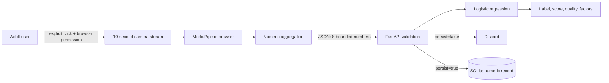

# Architecture

FocusLens separates raw webcam processing from server-side analysis. Frames exist only in the browser's live video element and MediaPipe runtime; they are never encoded, uploaded, logged, or persisted by the application.

## Browser boundary

The camera starts only after both safeguards are checked and the user presses **Start**. `getUserMedia` asks the browser for video without audio. MediaPipe Face Landmarker then processes frames locally for 10 seconds. The stream is stopped automatically, by the Stop button, or when the page is left.

The browser derives eye openness, gaze stability, head alignment, blink rate, mouth activity, face presence, movement level, and framing stability. Only their aggregated numeric values are sent to `/api/v1/analyze`.

The MediaPipe JavaScript/WASM runtime and face-landmarker model are loaded from pinned jsDelivr and Google Storage URLs on first use. Those resources run client-side. A production deployment with stricter supply-chain requirements should self-host pinned, checksum-verified copies.

## API boundary

Pydantic bounds every feature and requires consent plus adult self-use confirmation. `extra="forbid"` rejects image, video, audio, identity, demographic, and other unexpected fields. Security headers restrict camera access to the same origin, prevent framing, and limit scripts/connections to the documented runtime hosts.

## Model lifecycle

1. `synthetic.py` deterministically generates non-personal observations.
2. `model.py` uses a stratified split, standardization, and multinomial logistic regression.
3. The generated Joblib artifact is excluded from Git and rebuilt on first start.
4. Each result includes the three largest signed contributions for the selected synthetic class.

The three classes describe the input window as `stable`, `variable`, or `interrupted`. They do not describe attention or any internal human state.

## Persistence

SQLite is used only when `persist=true`. Stored records contain timestamps, model outputs, source metadata, and numeric signals. They contain no raw media, names, identity embeddings, or demographic attributes.

## Deployment

Camera APIs work on `localhost`. Remote deployments must use HTTPS. The Docker image serves the UI and API as a single origin, which keeps CORS and camera permission boundaries simple.

## Failure behavior

Validation fails closed. Missing confirmations, out-of-range values, invalid sources, and unexpected fields return `422` before inference. If camera permission or model loading fails, the browser stops any active stream and leaves manual/synthetic mode available. Unexpected API errors return a generic response without echoing request content.
