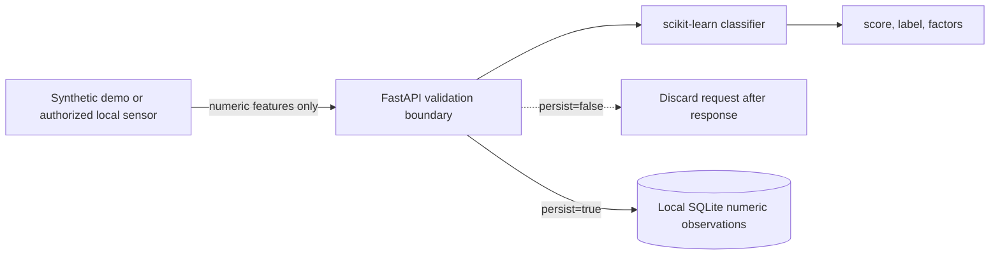

# Architecture

FocusLens is deliberately smaller than the academic prototype it replaces. The system boundary is designed around data minimization rather than camera streaming.

## Request boundary

The API accepts eight bounded numeric features plus explicit consent and persistence flags. Pydantic is configured with `extra="forbid"`, so image, identity, name, age, gender, and other unexpected fields are rejected.

## Model lifecycle

1. `synthetic.py` generates deterministic non-personal observations.
2. `model.py` splits the data, standardizes features, and trains multinomial logistic regression.
3. The generated Joblib artifact is excluded from Git and rebuilt on first start.
4. Each result includes the three largest signed feature contributions for the selected class.

## Persistence

SQLite is used only when `persist=true`. Stored records contain model outputs and numeric features. They do not contain raw media, names, identity embeddings, or demographic attributes.

## Failure behavior

Validation fails closed. Missing consent, out-of-range values, and unexpected fields produce a `422` response before inference. Unexpected server errors return a generic response without echoing request content.
